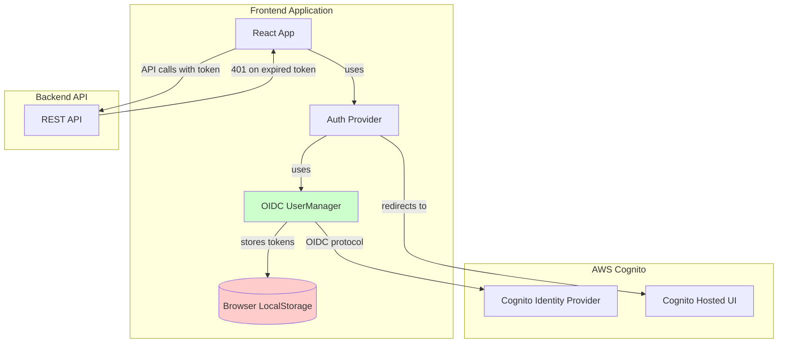
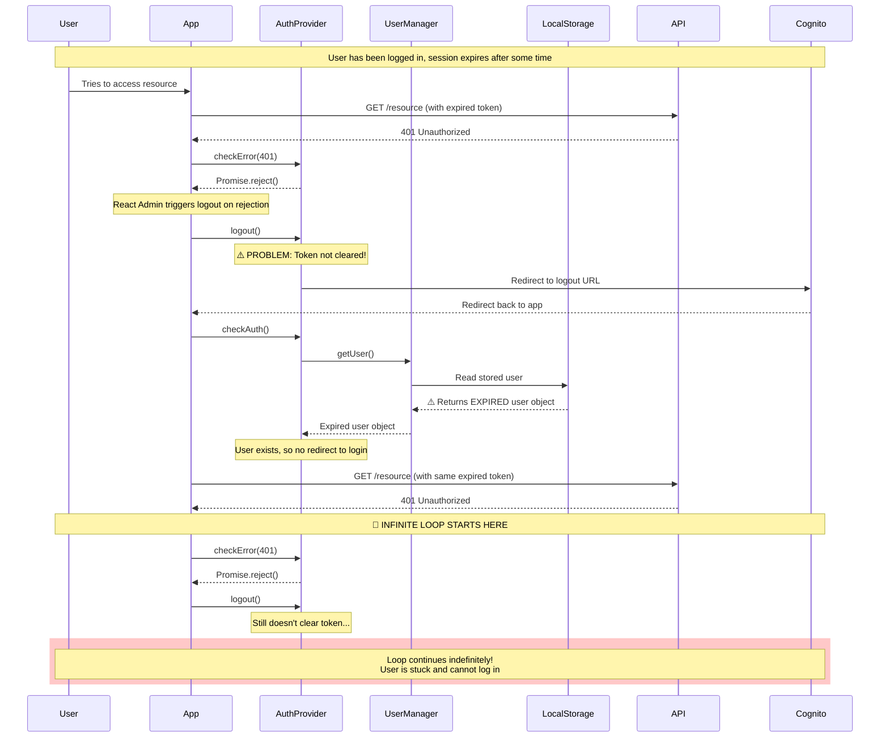
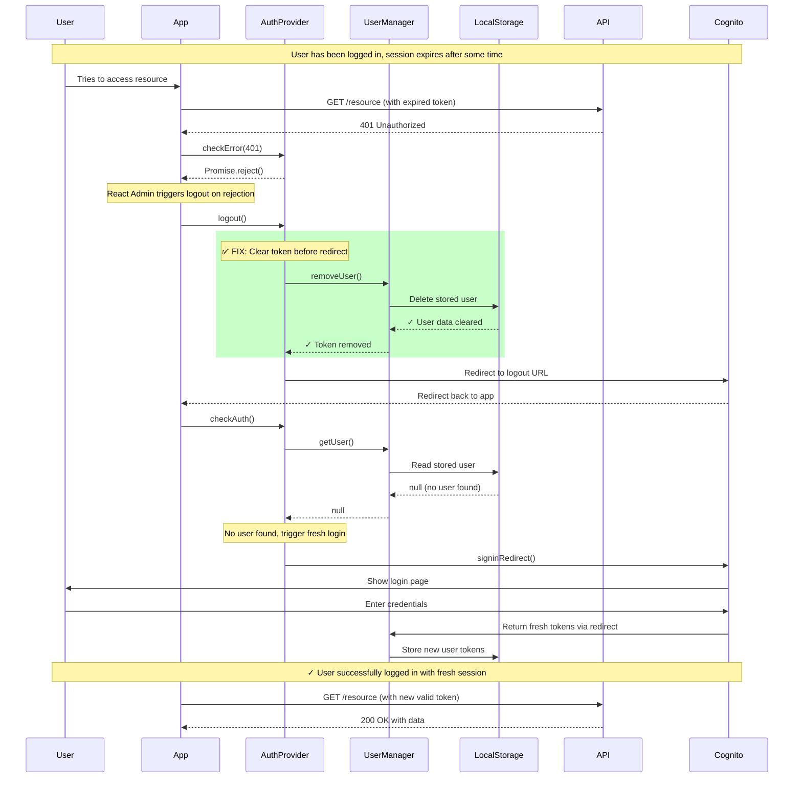
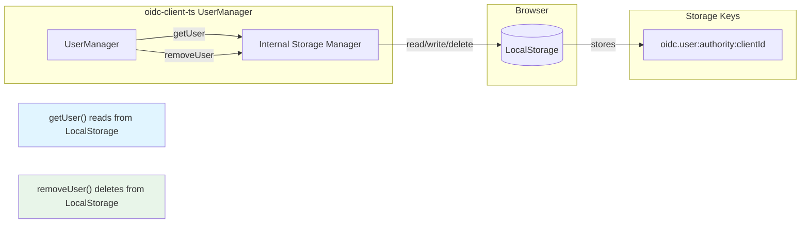

# Cognito Authentication Flow - Problem and Solution

This document illustrates how the application uses AWS Cognito for authentication, the reauth loop problem that existed, and how this PR fixes it.

## Architecture Overview



## The Problem: Reauth Loop

### Before This PR - Infinite Loop Scenario



### Key Issue

The problem occurred because:
1. **Token stored in LocalStorage**: The `oidc-client-ts` library stores user tokens in browser LocalStorage
2. **Logout didn't clear storage**: The `logout()` method only redirected to Cognito but didn't clear local tokens
3. **checkAuth found expired token**: After logout redirect, `checkAuth()` called `userManager.getUser()` which found the expired token still in LocalStorage
4. **No fresh login triggered**: Since a user object existed (even though expired), the app didn't redirect to the login page
5. **Same expired token reused**: The app tried to use the same expired token, got 401, and the cycle repeated

## The Solution: Clear Token on Logout

### After This PR - Clean Logout Flow



## Code Changes

### Key Change in `authProvider.ts`

**Before:**
```typescript
async logout(_params: unknown) {
  console.log('logout');

  await new Promise((resolve) => {
    setTimeout(resolve, 2000);
  });

  return signoutRedirect();
}
```

**After:**
```typescript
async logout(_params: unknown) {
  console.log('logout');

  // Clear the stored OIDC token to prevent reauth loop when session expires
  if (!MOCKS_ENABLED) {
    await userManager.removeUser();  // ← NEW: Clears token from LocalStorage
  }

  await new Promise((resolve) => {
    setTimeout(resolve, 2000);
  });

  return signoutRedirect();
}
```

## How OIDC UserManager Works



### What `removeUser()` Does

The `userManager.removeUser()` method from `oidc-client-ts`:
1. Removes the user object from browser LocalStorage
2. Clears the stored access token, id token, and refresh token
3. Clears any associated session state
4. Returns a Promise that resolves when cleanup is complete

This ensures that subsequent calls to `userManager.getUser()` return `null`, triggering a fresh login flow.

## Authentication Flow Components

### Components Used

1. **oidc-client-ts**: OIDC (OpenID Connect) client library that handles:
   - Token storage in LocalStorage
   - Silent token renewal
   - OIDC protocol communication with Cognito
   - Authorization code flow

2. **AWS Cognito**: Identity provider that:
   - Manages user authentication
   - Issues JWT tokens (id_token, access_token)
   - Provides hosted UI for login/logout
   - Validates tokens

3. **React Admin AuthProvider**: Application auth interface that:
   - Implements `login`, `logout`, `checkAuth`, `checkError`
   - Integrates with React Admin framework
   - Manages auth state and navigation

## Summary

### Problem
- Expired tokens remained in LocalStorage after logout
- App attempted to reuse expired tokens
- Created infinite loop of 401 errors and failed logout attempts

### Solution  
- Call `userManager.removeUser()` during logout
- Ensures LocalStorage is cleared before redirect
- Subsequent `checkAuth()` finds no token → triggers fresh login
- User can successfully log in with new valid session

### Impact
- ✅ No more infinite reauth loops
- ✅ Clean logout behavior
- ✅ Proper session expiration handling
- ✅ No breaking changes to existing functionality
